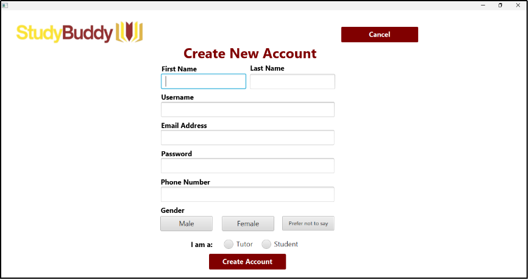
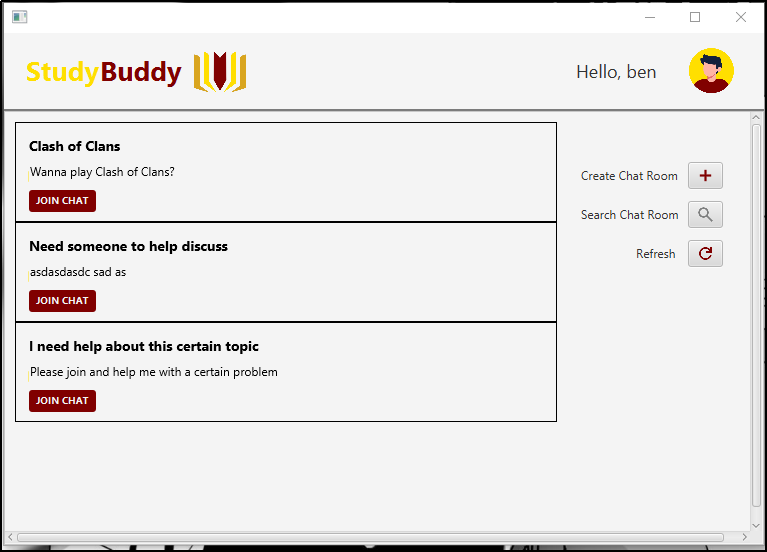
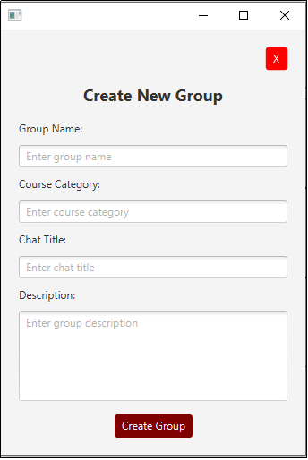
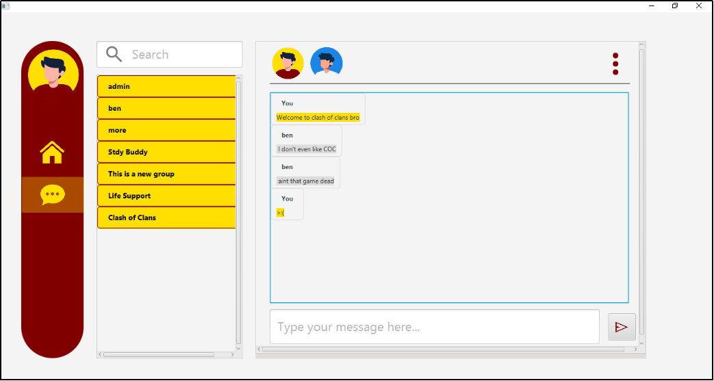

## Project Overview:

A software designed to provide students with an **in-university platform** that allows them to **find relevant study groups** that share the same academic interest, course, and/or studying preferences. It aims to help PUP students that are struggling with finding relevant study groups.

---

## Software Requirements:
- Windows 10 / 11
- Java Development Kit (JDK)  23
- JavaFX SDK (already included in JDK 23)
- MySQL Database Server (8.0+)
- MySQL Connector for Java (Provided in the repository)
- Maven (IntelliJ IDEA Provided otherwise manual installation of maven)

## User Guide
##### 1. Login & Registration


##### 2. Sign-Up


_preferrably the system should require the usage of student numbers as credentials_

#### 3. Joining Groups of Interest

- Create a study group by clicking the “Create” button and provide

#### 4. Creation of Group Chats


#### 5. Group Chats Page


---
## Installation & Setup:

##### Pre-requisites:
- Download Java Development Kit and JavaFX SDK (ver. 23)
- Clone the repository

```git  
git clone https://github.com/Brenedict/OOP-MiniHackathon.git 
```

##### Connect the MYSQLConnector
- File > Project Structure > Modules > Dependencies > Add Jar or Directories > Locate the mysqlconnector under
  
_OOP-MiniHackathon\lib\mysql-connector-j-9.0.0.jar_

##### Database preparations
- Create a database
  _CREATE DATABASE studygroup;_

- Use the database you created
  _USE studygroup_
  
- Update DatabaseConnection.java constructor with your MySQL credentials

```Java
  con = DriverManager.getConnection(<copy_JDBC_session_link>, <mysql-username, <mysql-password>);
```

---
### Simulation of real-time chatting:
- Run multiple instances of the application and you can talk between them.

